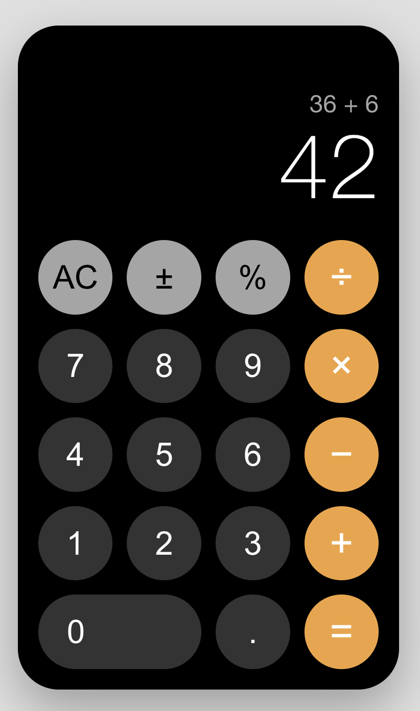

# iPhone Calculator Assessment Sample

This project is a React-based clone of the iPhone calculator. 
It replicates the look and feel of the iOS calculator, including its button layout, basic arithmetic operations, and responsive design.

Solution Screenshot:



## Features

- Responsive iPhone-style calculator UI
- Supports addition, subtraction, multiplication, and division
- Handles decimals, percentage, and sign toggling (+/-)
- Keyboard and mouse/touch input support
- Error handling for invalid operations (e.g., division by zero)
- Built with TypeScript and React

## Getting Started

### Prerequisites

- [Node.js](https://nodejs.org/) (v14 or higher recommended)
- [npm](https://www.npmjs.com/) (comes with Node.js)

### Installation

1. Clone the repository or download the source code.
2. Navigate to the `ProblemTwo/iphone-calculator` directory:

    ```sh
    cd ProblemTwo/iphone-calculator
    ```

3. Install dependencies:

    ```sh
    npm install
    ```

### Running the App

To start the development server and view the calculator in your browser:

```sh
npm start
```

This will open [http://localhost:3000](http://localhost:3000) in your default browser.

### Running Tests

To run the unit tests:

```sh
npm test
```

Test results will be displayed in the terminal. You can also run:

```sh
  Calculator App
    ✓ renders the calculator and initial display is 0 (15 ms)
    ✓ should display the number when a number key is pressed (33 ms)
    ✓ should perform addition correctly (15 ms)
    ✓ should perform subtraction correctly (13 ms)
    ✓ should perform multiplication correctly (14 ms)
    ✓ should perform division correctly (13 ms)
    ✓ should clear the display when AC is pressed (13 ms)
    ✓ should toggle the sign of the number (11 ms)
    ✓ should calculate the percentage correctly (10 ms)
    ✓ should display "Error" when dividing by zero (13 ms)
    ✓ should display the calculation history after pressing equals (16 ms)
    ✓ should clear the calculation history when a new number is entered after a calculation (17 ms)

Test Suites: 1 passed, 1 total
Tests:       12 passed, 12 total
Snapshots:   0 total
Time:        0.614 s, estimated 1 s
Ran all test suites related to changed files.
```

This will launch the test runner in interactive watch mode.

## Project Structure

- `src/components/` - Calculator UI components
- `src/configs/` - Calculator key configuration and enums
- `src/App.tsx` - Main application logic

